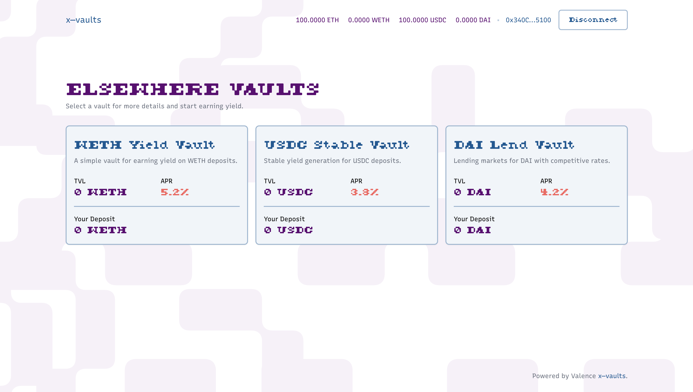

# X—Vault Demo App



A simple web application for interacting with ERC-4626 vault contracts on Ethereum mainnet in order to integrate with Valence cross-chain vaults. Built with Next.js, Tailwind CSS, and wagmi. Nix reproducible environment and Foundry/Anvil for local Ethereum development.

## Development

1. Enter environment and install dependencies:

   ```bash
   nix develop
   ```

   This will automatically install all dependencies and set up your development environment.

2. Start the local Anvil node (Ethereum testnet):

   ```bash
   start-anvil
   ```

   This will start a local Ethereum node that forks mainnet, giving you access to real mainnet state while allowing local testing.

   The node will run with the following configuration:

   - Chain ID: 31337
   - Block time: 12 seconds
   - Initial account balance: 10,000 ETH
   - RPC URL: http://localhost:8545
   - Fork Block: 19,250,000

3. Generate a deployer key and deploy the vaults:

   ```bash
   # Generate a new deployer key, select option 1 to generate a new key
   manage-key

   # Deploy vaults
   deploy-vaults
   ```

   This will deploy the test tokens (WETH, USDC, DAI) and their corresponding vaults.

4. Configure your browser wallet:

   - Network Name: Anvil Local
   - RPC URL: http://localhost:8545
   - Chain ID: 31337
   - Currency Symbol: ETH

5. Get test tokens using the faucet:

   ```bash
   # Check your wallet's current balances
   faucet balance YOUR_WALLET_ADDRESS

   # Mint some test tokens
   faucet mint YOUR_WALLET_ADDRESS ETH 10   # Get 10 ETH
   faucet mint YOUR_WALLET_ADDRESS WETH 10  # Get 10 WETH
   faucet mint YOUR_WALLET_ADDRESS USDC 100 # Get 100 USDC
   faucet mint YOUR_WALLET_ADDRESS DAI 100  # Get 100 DAI
   ```

6. Start the development server:

   ```bash
   npm run dev
   ```

7. Open [http://localhost:3000](http://localhost:3000) in your browser.

## Environment Variables

The project uses two environment files:

### `.env` (Persistent Environment)

This file stores persistent environment variables and is created by the `manage-key` command if it does not yet exist. It should contain:

```bash
# Persistent environment variables
DEPLOYER_PRIVATE_KEY=<your-deployer-private-key>
DEPLOYER_ADDRESS=<your-deployer-address>
NEXT_PUBLIC_REOWN_PROJECT_ID=<reown-project-id>
NEXT_PUBLIC_WALLETCONNECT_PROJECT_ID=<walletconnect-project-id>  # Might be the same as the reown project id
```

Do not commit this file to version control.

### `.env.local` (Session Environment)

**NOTE** `deploy-vaults` is deprecated. The UI will not read from these variables. See [#4](https://github.com/timewave-computer/x-vault-demo/issues/4).

This file is automatically generated by the `deploy-vaults` command and contains the deployed contract addresses:

```bash
# Session-specific environment variables
NEXT_PUBLIC_WETH_ADDRESS=<deployed-weth-address>
NEXT_PUBLIC_USDC_ADDRESS=<deployed-usdc-address>
NEXT_PUBLIC_DAI_ADDRESS=<deployed-dai-address>
NEXT_PUBLIC_WETH_VAULT_ADDRESS=<deployed-eth-vault-address>
NEXT_PUBLIC_USDC_VAULT_ADDRESS=<deployed-usdc-vault-address>
NEXT_PUBLIC_DAI_VAULT_ADDRESS=<deployed-dai-vault-address>
```

This file is regenerated each time you run `deploy-vaults` and should not be committed to version control.

## Available Commands

The development environment provides several useful commands:

- `start-anvil`: Start the local Ethereum testnet
- `manage-key`: Manage deployer private key
- `deploy-vaults`: Deploy test vaults to local network. NOTE: deprecated
- `faucet`: Manage token balances
  - `faucet balance <address>`: Show token balances
  - `faucet mint <address> <token> <amount>`: Mint tokens to address
  - `faucet burn <address> <token> <amount>`: Burn tokens from address
  - `faucet`: Show help menu
- `npm run dev`: Start Next.js development server
